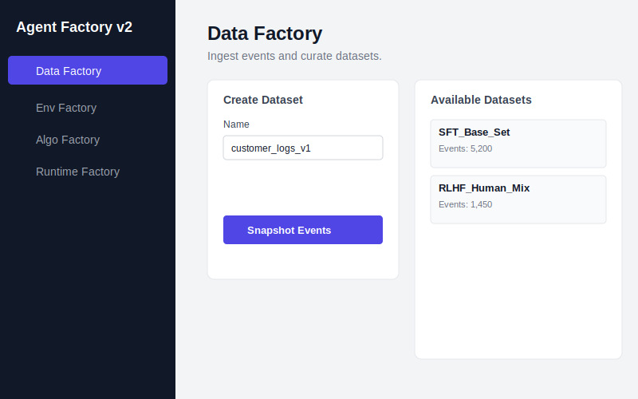
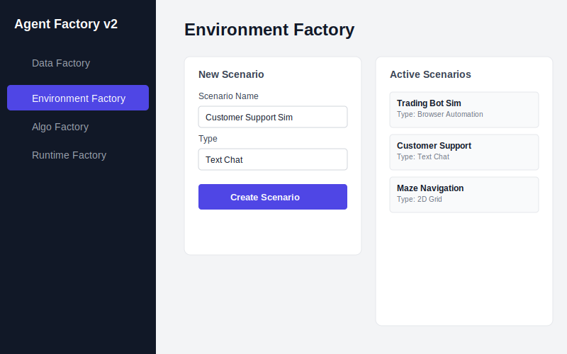
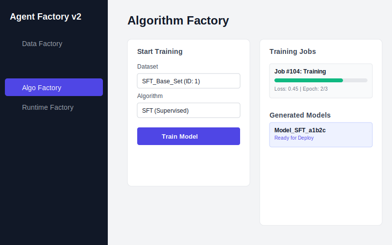
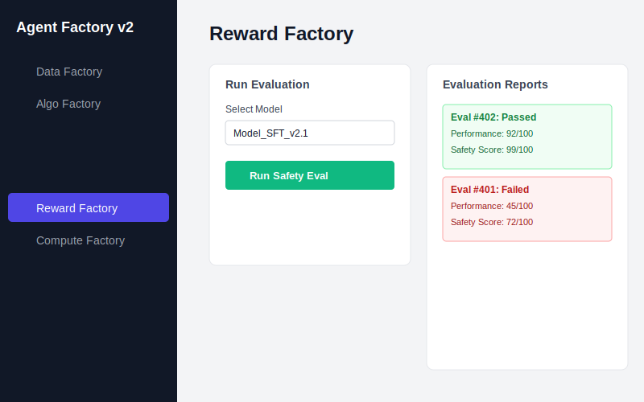
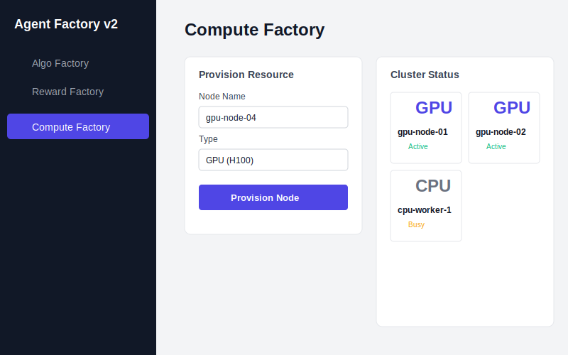
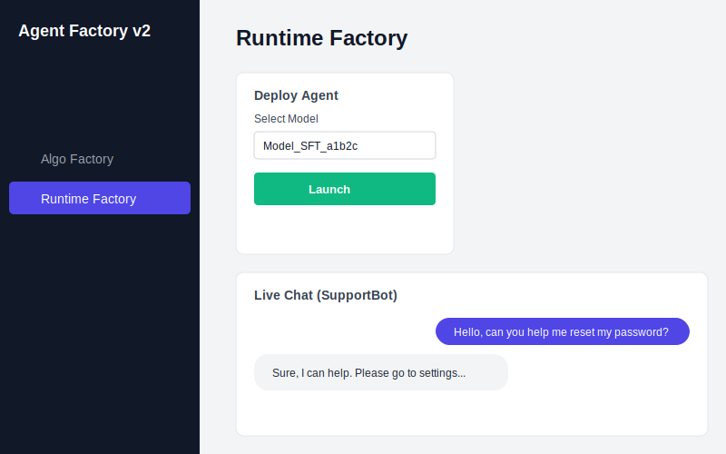

# 🏭 Agent Factory

> **The Industrial-Grade Platform for Building, Training, and Deploying AI Agents.**

**Agent Factory** is a modular, end-to-end platform designed to industrialize the lifecycle of AI Agents. Unlike ad-hoc scripts or scattered notebooks, Agent Factory standardizes the process into 6 distinct "Production Lines" (Factories), decoupling data ingestion, environment simulation, algorithm training, and deployment.

---

## 🌟 Key Advantages

### 1. Modular "Factory" Architecture
We move beyond monolithic agent scripts. By separating concerns into 6 dedicated factories, developers can upgrade a specific component (e.g., switching from PPO to DPO in the *Algo Factory*) without breaking the environment or data pipelines.

### 2. Visual & API-First
*   **Frontend Dashboard:** A React-based control center to visualize training progress, manage clusters, and chat with agents.
*   **REST API:** Every action available in the UI is backed by a fully documented FastAPI backend, allowing for programmatic automation and CI/CD integration.

### 3. Extensible & Open
Built on standard stacks (FastAPI + React). The codebase is designed for easy extension—add your own custom Environments, Reward Functions, or Model Architectures with minimal boilerplate.

---

## 📸 Factory Tour (Features)

The platform is divided into 6 integrated modules:

### 📊 Data Factory
*Ingest, clean, and version control your datasets.*
- **Capability:** Real-time event stream monitoring and dataset management.
- **Use Case:** Ingesting customer support logs or gameplay trajectories for offline RL.

### 🌍 Environment Factory
*Define the world your agents live in.*
- **Capability:** Create text-based, browser-based, or grid-world simulation scenarios.
- **Use Case:** Setting up a "Sales Call" simulator or a "Web Browsing" sandbox.

### 🧠 Algorithm Factory
*The brain of the operation.*
- **Capability:** Configure training runs, select baselines (SFT, PPO, DQN), and track loss curves.
- **Use Case:** Fine-tuning Llama-3 on your processed Data Factory datasets.

### ⚖️ Reward Factory
*Align agents with human intent.*
- **Capability:** Define objective functions, run safety evaluations, and manage "Constitutional AI" rules.
- **Use Case:** Ensuring an agent doesn't hallucinate or output toxic content before deployment.

### 🖥️ Compute Factory
*Manage the engine room.*
- **Capability:** Provision and monitor GPU/CPU resources, manage clusters, and view utilization.
- **Use Case:** Allocating H100 nodes for training vs. CPU nodes for environment rollout generation.

### 💬 Runtime Factory
*Where agents go to work.*
- **Capability:** One-click deployment of trained models to inference endpoints with a chat sandbox.
- **Use Case:** A/B testing two agent versions and manually verifying their responses.

---

## 🚀 Roadmap

We are building towards **v1.0**. Here is the plan:

### Phase 1: The Foundation (Current - MVP)
- [x] Core Architecture (6 Factories)
- [x] Basic UI/UX Dashboard
- [x] Mock Simulation & Training Loops
- [x] End-to-End Flow Validation

### Phase 2: Integration (Next Steps)
- [ ] **Real Model Integration:** Support for HuggingFace Transformers & PyTorch training loops.
- [ ] **Dockerized Environments:** Sandboxed execution for dangerous agent tools (Code Interpreter).
- [ ] **Vector Database:** Integration with Chroma/Pinecone for Agent Memory (RAG).

### Phase 3: Scale & Production
- [ ] **Kubernetes Operator:** Native K8s support for scaling training jobs.
- [ ] **Multi-Agent Orchestration:** Swarm protocols (agents talking to agents).
- [ ] **Plugin Marketplace:** Community-contributed environments and reward functions.

---

## 🤝 Contributing & Sharing

We welcome contributions! This project aims to be the standard shared infrastructure for Agent developers.

### How to Develop
1. **Fork & Clone** the repository.
2. **Setup:** Run `./setup.sh` to install Python & Node dependencies.
3. **Run:** Execute `./run.sh` to start the dev servers.
    - Backend: `http://localhost:8000/docs` (Swagger UI)
    - Frontend: `http://localhost:5173`

### Development Standards
- **Backend:** Follow PEP 8. Use `pydantic` for data validation.
- **Frontend:** Functional React components with Hooks. Tailwind CSS for styling.
- **Tests:** Run `python3 run_tests.py` before submitting PRs.

### License
This project is open-sourced under the MIT License.

---

*Built with ❤️ by the Agent Factory Team.*