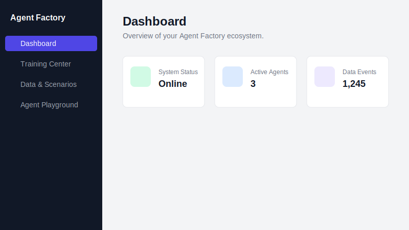
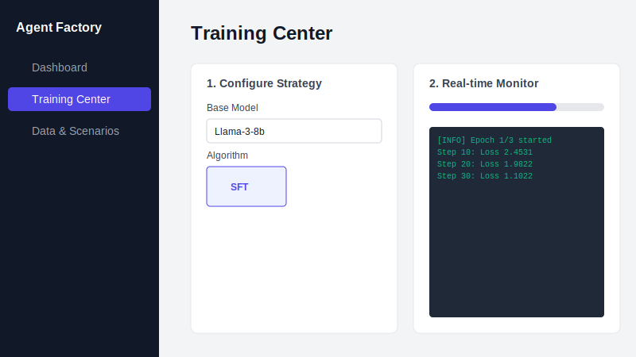
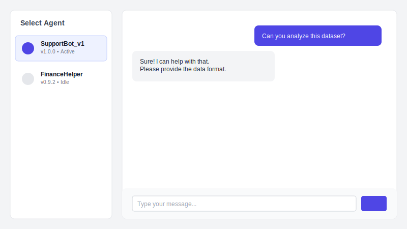

# Agent Factory

**Agent Factory** is an enterprise-grade, end-to-end platform for training, evaluating, and deploying AI Agents. It provides a complete lifecycle management system—from data ingestion to runtime serving—designed to be modular, scalable, and user-friendly.


## 📸 UI Preview

### 1. Dashboard
Monitor your entire agent ecosystem, system health, and real-time metrics.


### 2. Training Center
Wizard-style interface to configure and monitor SFT/RLHF training jobs without writing code.


### 3. Agent Playground
Test your deployed agents immediately in an interactive chat environment.


## 🏗 System Architecture

The system is built upon 6 specialized "Factories" that handle specific stages of the Agent lifecycle.

```ascii
┌─────────────────────────────────────────────────────────────────────────┐
│                          Frontend (React + Vite)                        │
│  [Dashboard] [Training Wizard] [Data Explorer] [Agent Playground]       │
└───────────────────────────────────┬─────────────────────────────────────┘
                                    │ REST API
                                    ▼
┌─────────────────────────────────────────────────────────────────────────┐
│                          Backend (FastAPI)                              │
│                                                                         │
│  ┌─────────────┐  ┌─────────────┐  ┌─────────────┐  ┌─────────────┐     │
│  │ Data Factory│  │ Env Factory │  │Algo Factory │  │Reward Factory│    │
│  │ (Ingestion) │  │ (Scenarios) │  │ (Training)  │  │ (Evaluation)│     │
│  └──────┬──────┘  └──────┬──────┘  └──────┬──────┘  └──────┬──────┘     │
│         │                │                │                │            │
│         ▼                ▼                ▼                ▼            │
│  ┌───────────────────────────────────────────────────────────────────┐  │
│  │                        Database (SQLite/SQLAlchemy)               │  │
│  └───────────────────────────────────────────────────────────────────┘  │
│                                                                         │
│  ┌─────────────┐                                    ┌─────────────┐     │
│  │Compute Fact.│                                    │Runtime Fact.│     │
│  │ (Resources) │                                    │  (Serving)  │     │
│  └─────────────┘                                    └─────────────┘     │
└─────────────────────────────────────────────────────────────────────────┘
```

## 📂 Project Structure

We welcome contributions! Here is the roadmap of the codebase to help you navigate:

```text
AgentFactory/
├── client/                     # ⚛️ Frontend Application
│   ├── src/
│   │   ├── components/         # Shared UI components (Layout, Sidebar, etc.)
│   │   ├── pages/              # Main Route Pages
│   │   │   ├── Dashboard.jsx   # System Overview
│   │   │   ├── Training.jsx    # Algorithm Factory UI
│   │   │   ├── DataEnv.jsx     # Data & Environment UI
│   │   │   └── Playground.jsx  # Runtime Chat UI
│   │   ├── App.jsx             # Router Configuration
│   │   └── ...
│   ├── package.json            # Frontend dependencies
│   └── vite.config.js          # Vite configuration
│
├── server/                     # 🐍 Backend Service
│   ├── database/               # ORM Models & DB Connection
│   │   ├── models.py           # DB Schema (Events, Agents, Jobs...)
│   │   └── database.py         # Engine setup
│   ├── routers/                # API Endpoints (The 6 Factories)
│   │   ├── algo_factory.py     # Training Logic
│   │   ├── runtime_factory.py  # Chat & Inference Logic
│   │   └── ...                 # (data, env, reward, compute)
│   ├── main.py                 # FastAPI Entry Point
│   └── requirements.txt        # Python dependencies
│
├── Demo/                       # 🧪 Testing & Verification
│   ├── run_e2e_test.py         # Automated End-to-End System Test
│   ├── scenario_config.json    # Sample Scenario Data
│   └── training_config.json    # Sample Training Job Data
│
└── AgentFactory.txt            # Product Requirements Document (PRD)
```

## 🚀 Development Guide

Follow these steps to set up your local development environment.

### 1. Backend Setup

The backend requires **Python 3.12+**.

```bash
# 1. Navigate to server directory
cd server

# 2. Create a virtual environment
python3 -m venv venv
source venv/bin/activate  # Windows: venv\Scripts\activate

# 3. Install dependencies
pip install -r requirements.txt

# 4. Start the Server
# Note: Run from the project root to ensure import paths work correctly
cd ..
source server/venv/bin/activate
python -m uvicorn server.main:app --reload --port 8000
```

*API Documentation will be available at: `http://127.0.0.1:8000/docs`*

### 2. Frontend Setup

The frontend requires **Node.js 18+**.

```bash
# 1. Navigate to client directory
cd client

# 2. Install dependencies
npm install

# 3. Start the Development Server
npm run dev
```

*The UI will be available at: `http://localhost:5173`*

### 3. Running Tests

We provide an automated End-to-End (E2E) test script that verifies the entire loop: Creating a Scenario -> Ingesting Data -> Training -> Deploying -> Chatting.

**Ensure both Backend and Frontend are running before executing tests.**

```bash
# Run from project root
python Demo/run_e2e_test.py
```

## 🤝 How to Contribute

We love your input! We want to make contributing to **Agent Factory** as easy and transparent as possible.

1.  **Fork the repo** and clone it locally.
2.  **Create a branch** for your feature or bugfix (`git checkout -b feature/amazing-feature`).
3.  **Commit your changes**. Please use clear, descriptive commit messages.
4.  **Add Tests**. If you add a new feature to a Factory, please try to add a corresponding check in `Demo/run_e2e_test.py`.
5.  **Submit a Pull Request**. Describe what you changed and why.

### Contribution Ideas (Roadmap)

*   **Algorithm Factory**: Connect the mock training loop to real PyTorch/HuggingFace `Trainer`.
*   **Runtime Factory**: Integrate `vLLM` or `Ollama` for local model inference instead of mocked responses.
*   **Data Factory**: Implement a real Data Labeling UI for RLHF.
*   **Infrastructure**: Add Docker Compose support for one-command startup.

## 📄 License

This project is licensed under the MIT License - see the [LICENSE](LICENSE) file for details.